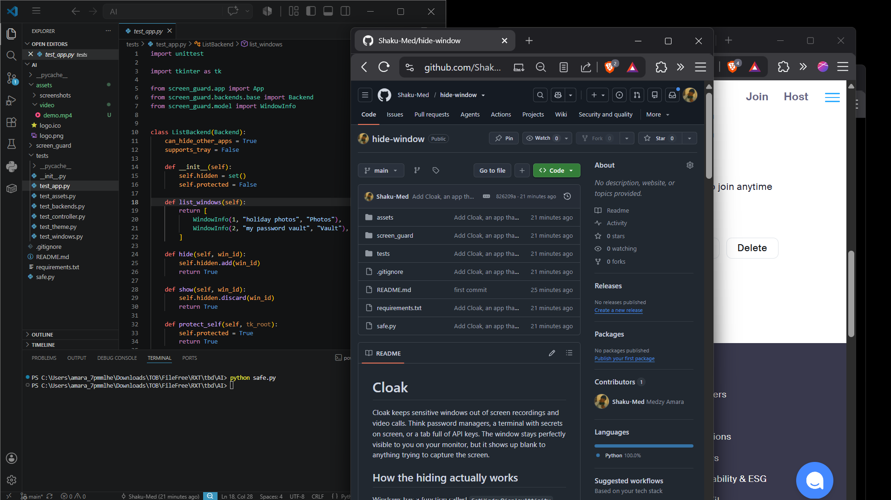
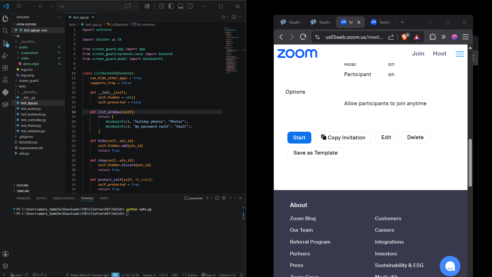

# Cloak

Cloak keeps sensitive windows out of screen recordings and video
calls. Think password managers, a terminal with secrets on screen, or a tab full
of API keys. The window stays perfectly visible to you on your monitor, but it
shows up blank to anything trying to capture the screen.

## See it in action

Here is a short recording of Cloak hiding and showing a window live in a screen
capture. It plays inline on GitHub, and the local preview uses the player below.

https://github.com/Shaku-Med/hide-window/raw/main/assets/video/demo.mp4

<video src="assets/video/demo.mp4" controls width="720"></video>

Without Cloak, the window is fully visible to whatever is capturing the screen:



With Cloak hiding that window, the same capture shows nothing where it used to
be, while you still see it normally on your own monitor:



## How the hiding actually works

Windows has a function called `SetWindowDisplayAffinity`. Set the flag
`WDA_EXCLUDEFROMCAPTURE` on a window and the desktop compositor leaves it out of
any capture, while you still see it normally. This needs Windows 10 version 2004
or newer.

There is one rule that makes this tricky. That function only works on a window
owned by the process that calls it. If you call it on another app's window from
your own script you get back error 5, access denied.

To get around that, the Windows backend runs the call from inside the target
process. It finds the address of the function in user32, writes a tiny piece of
machine code into the other process, and starts a thread there that makes the
call. Because the call now comes from inside the owning process, it succeeds.
This is the same approach the open source tool Evanesco uses, and it is the only
reliable way for an outside tool to flip another app's setting.

## Running it

You only need Python with Tk, which ships with the standard installer. No extra
packages are required on Windows.

```
python safe.py
```

or

```
python -m screen_guard
```

On Windows a permission prompt appears. Say yes. The app needs administrator
rights so it can reach into other processes, so it relaunches itself with those
rights and the first process steps aside.

You want 64 bit Python on Windows, since the injected stub is 64 bit. Check it
like this and look for 64:

```
python -c "import struct; print(struct.calcsize('P') * 8)"
```

## Using the window

The list refreshes on its own every couple of seconds.

Type comma separated words into the keyword box. Any window whose title contains
one of them gets hidden automatically while auto hide is on. The defaults cover
common things like password, secret, and bitwarden.

To hide one window by hand, select it and press Hide / show selected. You can
also double click the row, or right click it for a small menu with Hide this
window and Show this window. The Hidden column tells you what happened:

- hidden means it worked
- FAILED means the window could not be hidden, see the notes below
- blank means we are leaving it alone

The buttons along the bottom:

- Hide / show selected hides or shows the window you picked in the list.
- Unhide ALL (reset) forces every visible window back to normal and turns auto
  hide off. Reach for this if a window got stuck hidden after a crash. It stays
  available even when nothing looks hidden, since that is exactly the case it
  helps you recover from.
- Minimize to tray hides the guard window but keeps it working. On Windows it
  lives in the system tray. Double click the tray icon to bring it back, right
  click for a menu.
- Quit (stop protecting) puts everything back and closes.

The same actions live in the Options menu at the top of the window if you prefer
a dropdown.

The window follows your system light or dark setting, including a dark title bar
on Windows, and it has a sensible size range so it cannot be stretched out of
shape.

The guard hides its own window from capture by default, so it will not leak into
your share. If you are teaching someone how to use it on a call, turn off Hide
this app from capture and the guard window becomes visible to your viewers while
it keeps hiding everything else.

## Putting windows back

The hidden state lives inside the other app, not in this tool, so it sticks
around until something turns it off. The guard turns it off for you when you
press Quit, when you press Ctrl C in the terminal, or when the app closes in any
normal way. There is a safety net that runs the cleanup on exit no matter how
the window closed.

The one case it cannot cover is a hard kill, like ending the task from the task
manager or closing the terminal window outright. Nothing gets a chance to run
then, so the affected windows stay hidden until their own app restarts. If that
happens, just start the guard again and press Unhide ALL (reset). It sweeps every
visible window back to normal.

## What works on each platform

Windows is the one place where you can hide windows that belong to other apps.
Everything described above applies there.

macOS only lets an app hide its own windows from capture, through the NSWindow
sharing setting. There is no public way to change another app's setting, so the
macOS backend lists windows as a read only view and protects its own window when
it can. To get the window listing, install the dependencies:

```
pip install -r requirements.txt
```

Linux has no general way to exclude an arbitrary window from capture on either
X11 or Wayland, so that backend also lists windows for reference only. The
listing uses `wmctrl` when it is installed.

## Tests

The logic that decides what to hide lives apart from the window code, so the
tests run without a screen and without any extra packages.

```
python -m unittest discover -s tests
```

## Notes worth knowing

Your antivirus or security tooling may flag this on Windows. Writing code into
another process and starting a thread there is exactly what malware does, even
though the intent here is the opposite. If hiding silently stops working, check
whether your security software stepped in and add an exception for Python on your
own machine.

A few windows can still show FAILED. A 32 bit app cannot host the 64 bit stub. A
process running at a higher privilege than the guard can refuse to be opened even
when you are an administrator.

This is a privacy helper, not a copy protection system. As Microsoft points out,
it does not stop someone pointing a phone at the screen. It only blocks the
software capture paths while the desktop compositor is running.

Please use it only on your own machine and your own apps.
