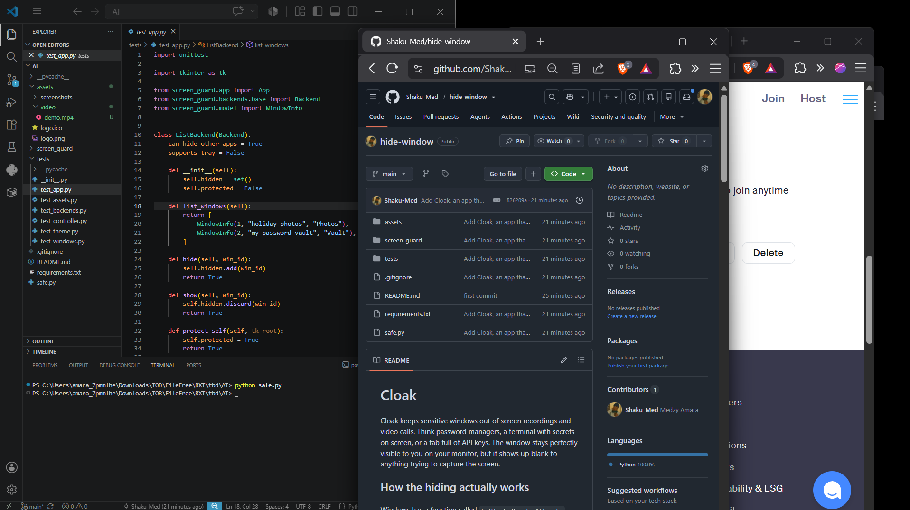
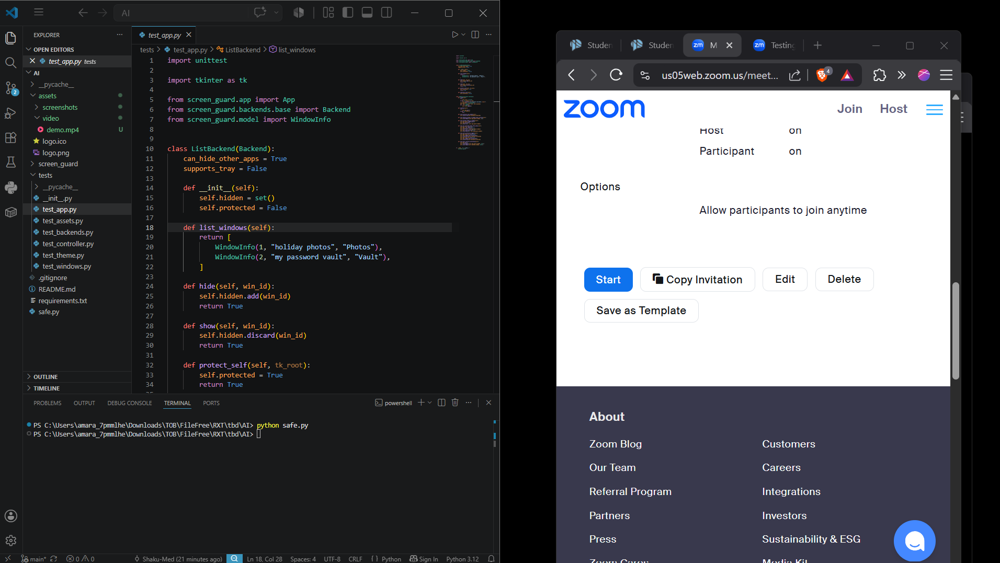

# Cloak

Cloak keeps sensitive windows out of screen recordings and video
calls. Think password managers, a terminal with secrets on screen, or a tab full
of API keys. The window stays perfectly visible to you on your monitor, but it
shows up blank to anything trying to capture the screen.

## See it in action

Here is a short recording of Cloak hiding and showing a window live in a screen
capture. It plays inline on GitHub, and the local preview uses the player below.

https://github.com/Shaku-Med/hide-window/raw/main/assets/video/demo.mp4

<video src="assets/video/demo.mp4" controls width="720"></video>

Without Cloak, the window is fully visible to whatever is capturing the screen:



With Cloak hiding that window, the same capture shows nothing where it used to
be, while you still see it normally on your own monitor:



## How the hiding actually works

Windows has a function called `SetWindowDisplayAffinity`. Set the flag
`WDA_EXCLUDEFROMCAPTURE` on a window and the desktop compositor leaves it out of
any capture, while you still see it normally. This needs Windows 10 version 2004
or newer.

There is one rule that makes this tricky. That function only works on a window
owned by the process that calls it. If you call it on another app's window from
your own script you get back error 5, access denied.

To get around that, the Windows backend runs the call from inside the target
process. It finds the address of the function in user32, writes a tiny piece of
machine code into the other process, and starts a thread there that makes the
call. Because the call now comes from inside the owning process, it succeeds.
This is the same approach the open source tool Evanesco uses, and it is the only
reliable way for an outside tool to flip another app's setting.

## Running it

You only need Python with Tk, which ships with the standard installer. No extra
packages are required on Windows.

```
python safe.py
```

or

```
python -m screen_guard
```

On Windows a permission prompt appears. Say yes. The app needs administrator
rights so it can reach into other processes, so it relaunches itself with those
rights and the first process steps aside.

You want 64 bit Python on Windows, since the injected stub is 64 bit. Check it
like this and look for 64:

```
python -c "import struct; print(struct.calcsize('P') * 8)"
```

## Using the window

The list refreshes on its own every couple of seconds.

Type comma separated words into the keyword box. Any window whose title contains
one of them gets hidden automatically while auto hide is on. The defaults cover
common things like password, secret, and bitwarden.

When one app has several windows open they fold into a collapsible group under
the app name, with a count next to it. Click the arrow to open or close it, and
Cloak remembers which groups you left closed. Apps with a single window stay as
plain rows.

Right click a group to act on everything inside it at once: hide them all, show
them all, keep them all active, or clear keep active for the group. The Hidden and
Active columns on the group row show how many of its windows are covered, like
2/3. Selecting one window inside a group and using the normal buttons still works
exactly as before, so grouping never takes the single window controls away.

To hide one window by hand, select it and press Hide / show selected. You can
also double click the row, or right click it for a small menu with Hide this
window and Show this window. The Hidden column tells you what happened:

* hidden means it worked
* FAILED means the window could not be hidden, see the notes below
* blank means we are leaving it alone

## Keep a window active

Plenty of apps watch for you leaving. When you click another window they get told
they were deactivated, and they act on it: dimming, pausing, marking you away,
stopping a timer. Keep active stops that one window from hearing you left, so it
stays "present" while you work in a Cloak hidden window next to it.

This works on any app, not just browsers. Browsers are simply the loudest example,
since a page also fires blur and flips `document.hasFocus()` the moment you click
away, so they are what the notes below use for illustration.

### How to use it

1. Start Cloak as admin (`python safe.py`). Say yes to the permission prompt.
2. Click the window that should stay present so Windows really focuses it first.
   For a browser that means click inside the page, not just the title bar.
3. In Cloak, select that same window in the list.
4. Press **Keep selected active**. You can also right click the row or use the
   Options menu. The Active column should say `KEEP`. If it says `FAILED`, open
   Options → Open debug log and check `cloak_debug.log`.
5. Hide the other window you want private, click into it, and work normally.
   Typing and clicking there is the point. Real OS focus can sit on the hidden
   window while the kept window still thinks you never left.
6. When you are done, press Keep selected active again on that row, or use
   Clear keep active in the menu.

Order matters. Focus the "stay present" window, arm Keep selected active, then
switch away. If you arm it while another app is already focused, some apps will
fight you, and Chromium browsers are the worst about it.

### What Cloak is doing

On Windows, Cloak reaches into the target process and subclasses that one top
level window, so the messages telling it that it was deactivated never arrive.
Those are ordinary window messages every Windows app receives, which is why this
is not a browser specific trick. Run Cloak as admin so OpenProcess and the in
process call are allowed.

It only touches the window you picked. An earlier version also patched the focus
APIs inside the target process, but those are shared by everything running in it,
so every other window of that app stopped responding. That is gone. Nothing
outside the chosen window is affected now.

When you come back to the kept window, Cloak pulses focus again so the app does
not get stuck looking "away" after a stray blur.

### Covering the kept window

Focus is not the only way a page can tell you left. Chromium also works out
whether its window is actually on screen by walking the windows stacked on top of
it, and when it decides it is fully covered it throttles timers to about one tick
a second and drops animation frames to roughly one a second. A page can measure
that even while focus and visibility still look perfectly normal, which is exactly
what the focus probe reports as heavily throttled.

That happens the moment you put a hidden window fullscreen over the kept one, and
no amount of focus work fixes it, because the decision is made from window
geometry rather than from anything sent to the window.

Cloak handles it from the other side. Chromium ignores any window that is not
fully opaque when it works out what is covering what, so every window Cloak hides
is nudged to 254 out of 255 opacity. You cannot see the difference, the window
still takes clicks and keys normally, and Chromium stops counting it as covering
anything. Timers and frames keep running at full speed underneath.

Windows that already manage their own transparency are left untouched, and the
original style goes back when the window is shown again. If some app misbehaves
with it, turn off **Stop hidden windows throttling the kept one** in the Options
menu and everything reverts.

If you ever need the browser side of this instead, Chromium accepts
`--disable-backgrounding-occluded-windows` and
`--disable-features=CalculateNativeWinOcclusion` at launch, which switches the
detection off wholesale. Cloak does not need it, and it only applies to a browser
you start yourself with those flags.

### The cursor

Windows has one shared cursor and every screen capturer reads it directly, so
normally the pointer gives you away. It drifts into the empty space where your
hidden window sits, and it flips to a text caret when you type. There is no way
to show yourself one cursor position and the capture a different one.

While Keep active is on, Cloak works around this. It makes the real system cursor
invisible, draws a pointer you can still see as an overlay that follows your mouse
and is left out of any capture, and parks a decoy pointer inside the kept window.
The result: on your side the cursor moves normally, and on the stream it rests
inside the active window and never changes shape. The decoy wanders a few pixels
so it does not look frozen.

It only does this while you are actually away. The decoy is a real window, so you
would see it too, and coming back to the kept window would leave two pointers on
screen. So the moment the kept window is focused again with your mouse inside it,
Cloak drops the whole thing and hands you the normal system cursor back. Step away
and it re engages on its own. You do not have to toggle anything.

Hovering the kept window without leaving your hidden one is handled the same way.
Your pointer is already sitting somewhere believable, so the follow arrow steps
aside and the decoy takes over the real position, tracking you exactly. One
pointer, no lag, nothing doubled. When you move back off the window the decoy
glides to its resting spot instead of snapping there, so the stream never sees it
teleport.

Two things to know. The overlay is always an arrow, so while you are away you will
not see the I-beam or resize cursors on your own screen. And the system cursor
change is desktop wide, so if Cloak is hard killed the pointer can stay invisible
until something restores it. Quit, Ctrl C, or Unhide ALL (reset) all put it back,
and reset also fixes it after a hard kill.

### Try it with the focus probe

There is a tiny local page that watches leave signals. From the repo root:

```
python focus_probe/server.py
```

Open the URL it prints (usually http://127.0.0.1:8765/) in Brave or Chrome.
Follow the Keep selected active steps on that browser window, then click and type
in another window. The big verdict on the page should stay **HERE**. Optional
button on the page: Unlock audio probe. That only unlocks an AudioContext test.
It should not flip the page to AWAY by itself.

More detail lives in `focus_probe/README.md`.

### Buttons along the bottom

* **Hide / show selected** hides or shows the window you picked.
* **Keep selected active** keeps that window looking focused while you work in
  a hidden one.
* **Unhide ALL (reset)** forces every visible window back to normal and turns
  auto hide off. Use this if something got stuck hidden after a crash.
* **Minimize to tray** hides the guard window but keeps it running. Double click
  the tray icon to bring it back.
* **Quit (stop protecting)** restores windows and closes Cloak.

The same actions are in the Options menu if you prefer a dropdown.

The window follows your system light or dark setting, including a dark title bar
on Windows, and it has a sensible size range so it cannot be stretched out of
shape.

The guard hides its own window from capture by default, so it will not leak into
your share. If you are teaching someone how to use it on a call, turn off Hide
this app from capture and the guard window becomes visible to your viewers while
it keeps hiding everything else.

## Putting windows back

The hidden state lives inside the other app, not in this tool, so it sticks
around until something turns it off. The guard turns it off for you when you
press Quit, when you press Ctrl C in the terminal, or when the app closes in any
normal way. There is a safety net that runs the cleanup on exit no matter how
the window closed.

The one case it cannot cover is a hard kill, like ending the task from the task
manager or closing the terminal window outright. Nothing gets a chance to run
then, so the affected windows stay hidden until their own app restarts. If that
happens, just start the guard again and press Unhide ALL (reset). It sweeps every
visible window back to normal.

## What works on each platform

Windows is the one place where you can hide windows that belong to other apps.
Everything described above applies there.

macOS only lets an app hide its own windows from capture, through the NSWindow
sharing setting. There is no public way to change another app's setting, so the
macOS backend lists windows as a read only view and protects its own window when
it can. To get the window listing, install the dependencies:

```
pip install -r requirements.txt
```

Linux has no general way to exclude an arbitrary window from capture on either
X11 or Wayland, so that backend also lists windows for reference only. The
listing uses `wmctrl` when it is installed.

## Tests

The logic that decides what to hide lives apart from the window code, so the
tests run without a screen and without any extra packages.

```
python -m unittest discover -s tests
```

## Notes worth knowing

Your antivirus or security tooling may flag this on Windows. Writing code into
another process and starting a thread there is exactly what malware does, even
though the intent here is the opposite. If hiding silently stops working, check
whether your security software stepped in and add an exception for Python on your
own machine.

A few windows can still show FAILED. A 32 bit app cannot host the 64 bit stub. A
process running at a higher privilege than the guard can refuse to be opened even
when you are an administrator.

This is a privacy helper, not a copy protection system. As Microsoft points out,
it does not stop someone pointing a phone at the screen. It only blocks the
software capture paths while the desktop compositor is running.

Please use it only on your own machine and your own apps.
